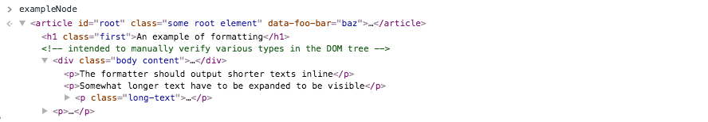

# jsdom-devtools-formatter [](https://travis-ci.org/jsdom/jsdom-devtools-formatter)

In a nutshell: Instead of trying to understand what [jsdom](https://github.com/jsdom/jsdom)'s elements represents by inspecting their _implementation_ objects like so:

<!-- screenshots should be of width 888px to match default layout on github.com -->

…let's just inspect them like they were real HTML elements:


Typical use-case would be some script/test that utilizes [jsdom](https://github.com/jsdom/jsdom) in a Node.js environment, e.g. [Jest](https://facebook.github.io/jest/).


## How to use

```bash
npm install jsdom-devtools-formatter
```

```js
// in some file.js
const jsdomDevtoolsFormatter = require('jsdom-devtools-formatter');
jsdomDevtoolsFormatter.install();

// You can also opt-out at some later point by:
jsdomDevtoolsFormatter.uninstall();
```

E.g. for Jest it's probably easiest to integrate through [`setupTestFrameworkScriptFile` configuration](https://facebook.github.io/jest/docs/en/configuration.html#setuptestframeworkscriptfile-string).

As a one-time thing also need to:
- Open Chrome's Devtools
- Click the gear in the upper right to go to Settings
- Under "Console", check _"Enable custom formatters"_


## Development

The source code is all plain vanilla JS and standard CommonJS modules.
Tests are written using [Jest](https://facebook.github.io/jest/)

See package.json's `scripts` sections for all available commands. The most useul ones are probably:
```bash
# run all tests once:
npm test

# run tests in "watch mode"
npm test -- --watch
```


### Testing
In addition to verifying _logical changes_ using the automated tests, it's recommended to verify that things "look & feel" as expected using the _manual_ tests:

- Open chrome://inspect and click the "Open dedicated DevTools for Node" link (one-time thing)
- Then run one of the following commands

```bash
npm run test:manual_node
# -or-
npm run test:manual_jest
```

It should stop at the `debugger` call, from there you can follow the inlined comment with instructions to play with the console output.


## Related resources

- https://github.com/jsdom/jsdom
- [Custom Object Formatters in Chrome DevTools (gdoc)](https://bit.ly/object-formatters)
- [Contributing to Chrome DevTools (gdoc)](https://bit.ly/devtools-contribution-guide)
- [Debugging Node.js with Chrome DevTools (medium)](https://medium.com/@paul_irish/debugging-node-js-nightlies-with-chrome-devtools-7c4a1b95ae27)
- [Debugging Node.js Apps](https://nodejs.org/en/docs/inspector/)
- [Debugger, Advanced usage, V8 Inspector Integration for Node.js](https://nodejs.org/dist/latest-v8.x/docs/api/debugger.html#debugger_v8_inspector_integration_for_node_js)
